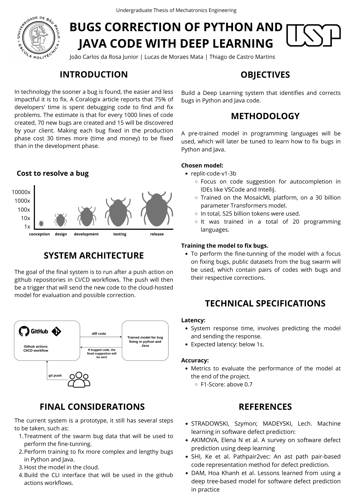

# BUGS CORRECTION OF PYTHON AND JAVA CODE WITH DEEP LEARNING

This is my Undergraduate Thesis, I'm building a deep learning system focused on solving bugs in Pyhton and Java.

The project is still in the beginning. The final delivery is scheduled for the end of the year, I still have several steps ahead and I will update through this public repository.

